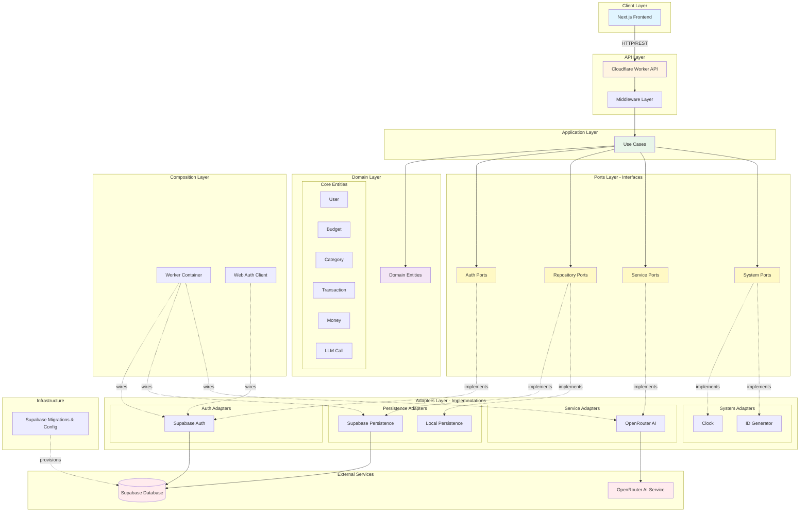
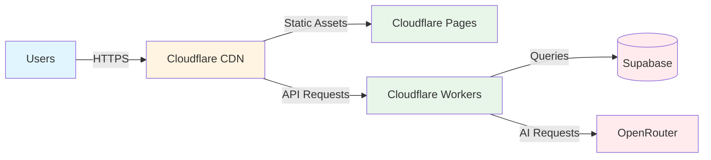

# BudgetWise Architecture

## Overview

BudgetWise is a modern budget management application built using **Clean Architecture** principles with a **monorepo** structure. The system is designed to be modular, testable, and deployable on edge computing platforms like Cloudflare Workers.

## Architecture Diagram



## Layer Breakdown

### 1. **Client Layer** (`apps/frontend`)

- **Technology**: Next.js 14+ with App Router
- **Purpose**: User interface for budget management
- **Features**:
  - Server-side rendering (SSR)
  - Client-side interactivity
  - Authentication UI
  - Budget, category, and transaction management
  - AI-powered transaction categorization

### 2. **API Layer** (`apps/api`)

- **Technology**: Cloudflare Workers (Hono framework)
- **Purpose**: HTTP API gateway
- **Routes**:
  - `/health` - Health checks
  - `/auth` - Authentication endpoints
  - `/budgets` - Budget CRUD operations
  - `/categories` - Category management
  - `/transactions` - Transaction operations
- **Middleware**:
  - Authentication
  - Error handling
  - CORS

### 3. **Application Layer** (`packages/usecases`)

- **Purpose**: Business logic orchestration
- **Modules**:
  - **Auth**: User registration, login, logout
  - **Budgets**: Create, update, delete, list budgets
  - **Categories**: Manage spending categories
  - **Transactions**: Record and categorize expenses/income
- **Principles**:
  - Use case per operation
  - Depends only on domain and ports
  - Framework-agnostic

### 4. **Domain Layer** (`packages/domain`)

- **Purpose**: Core business entities and rules
- **Entities**:
  - `User`: User identity and profile
  - `Budget`: Budget periods and limits
  - `Category`: Spending categories with hierarchy
  - `Transaction`: Financial transactions
  - `Money`: Value object for currency amounts
  - `LLMCall`: Tracking AI service usage
- **Principles**:
  - Pure TypeScript
  - No external dependencies
  - Rich domain models with validation

### 5. **Ports Layer** (`packages/ports`)

- **Purpose**: Define interfaces for external dependencies
- **Port Types**:
  - **Auth Ports**: Authentication client/server interfaces
  - **Repository Ports**: Data persistence contracts
  - **Service Ports**: External service interfaces (AI, etc.)
  - **System Ports**: Clock, ID generation
- **Principles**:
  - Dependency inversion
  - Testability via mocking

### 6. **Adapters Layer** (`packages/adapters`)

- **Purpose**: Implement port interfaces with real technologies
- **Adapters**:
  - `auth-supabase`: Supabase authentication
  - `persistence/supabase`: Supabase database operations
  - `persistence/local`: In-memory persistence for testing
  - `services/openrouter`: OpenRouter AI integration
  - `system`: Clock and ID generation utilities
- **Principles**:
  - Interchangeable implementations
  - Infrastructure concerns isolated

### 7. **Composition Layer** (`packages/composition`)

- **Purpose**: Dependency injection and wiring
- **Modules**:
  - `cloudflare-worker`: DI container for API workers
  - `web-auth-client`: DI container for frontend auth
- **Principles**:
  - Single place for dependency configuration
  - Environment-specific composition

### 8. **Infrastructure** (`infra/supabase`)

- **Purpose**: Database schema and provisioning
- **Components**:
  - Migrations (SQL schema definitions)
  - Seed data
  - Configuration (config.toml)

### 9. **Schemas** (`packages/schemas`)

- **Purpose**: Shared validation schemas
- **Technology**: Zod
- **Schemas**: Request/response validation, API contracts

## Data Flow

### Typical Request Flow

1. **Client** sends HTTP request to API
2. **API** authenticates via middleware
3. **API** routes to appropriate handler
4. **Handler** invokes **Use Case**
5. **Use Case** validates with **Domain** entities
6. **Use Case** calls **Port** interfaces
7. **Adapters** execute actual operations (DB, external APIs)
8. **Response** flows back through layers

### Example: Create Transaction

```text
Frontend → API (/transactions POST)
  → Auth Middleware (validate token)
  → Create Transaction Use Case
    → Transaction Domain (validate amount, category)
    → Transaction Repository Port
      → Supabase Persistence Adapter
        → Supabase Database
    ← Transaction saved
  ← Use case returns transaction
← API returns 201 Created
```

## Key Architectural Patterns

### Clean Architecture

- **Independence**: Core business logic independent of frameworks
- **Testability**: Each layer can be tested in isolation
- **Flexibility**: Easy to swap implementations (e.g., switch from Supabase to PostgreSQL)

### Dependency Inversion

- High-level modules (use cases) don't depend on low-level modules (adapters)
- Both depend on abstractions (ports)

### Repository Pattern

- Abstract data access behind repository interfaces
- Supports multiple persistence strategies

### Monorepo

- **Tool**: pnpm + Turborepo
- **Benefits**: Code sharing, atomic changes, unified testing
- **Structure**: Apps and packages clearly separated

## Technology Stack

### Frontend

- Next.js 14+
- React
- TypeScript
- Tailwind CSS

### Backend

- Cloudflare Workers
- Hono (web framework)
- TypeScript

### Database

- Supabase (PostgreSQL)

### AI/ML

- OpenRouter (LLM integration)
- Transaction categorization
- Invoice parsing

### Testing

- Vitest (unit & integration)
- Playwright (E2E)
- Coverage reporting

### Build & Deploy

- pnpm (package manager)
- Turborepo (build system)
- Cloudflare Pages/Workers (deployment)

## Design Principles

1. **Separation of Concerns**: Each layer has a single responsibility
2. **Dependency Rule**: Dependencies point inward toward domain
3. **Testability**: All layers independently testable
4. **Framework Independence**: Core logic not tied to frameworks
5. **Type Safety**: Strong typing throughout with TypeScript
6. **Edge-First**: Designed for edge computing (Cloudflare)

## Testing Strategy

- **Unit Tests**: Domain and use cases
- **Integration Tests**: API routes, repositories, auth
- **E2E Tests**: Full user workflows
- **Coverage Target**: >80% for critical paths

## Deployment Architecture



### Deployment Environments

- **Frontend**: Cloudflare Pages (global CDN)
- **API**: Cloudflare Workers (edge compute)
- **Database**: Supabase (PostgreSQL with global replication)
- **AI**: OpenRouter (API gateway to multiple LLMs)

## Security Considerations

1. **Authentication**: JWT tokens via Supabase Auth
2. **Authorization**: Row-level security in database
3. **API Security**: Middleware-based auth checks
4. **Data Validation**: Zod schemas for all inputs
5. **Secrets Management**: Environment variables, Cloudflare Secrets

## Scalability

- **Horizontal**: Cloudflare Workers auto-scale globally
- **Database**: Supabase connection pooling
- **Caching**: Edge caching for static content
- **AI Rate Limiting**: Tracked via llm_calls table

## Future Considerations

1. **Event Sourcing**: Consider for audit trail
2. **CQRS**: Separate read/write models for complex queries
3. **WebSockets**: Real-time budget updates
4. **Offline Support**: PWA with local-first sync
5. **Multi-tenancy**: Organization-level budgets

## References

- [Clean Architecture by Robert C. Martin](https://blog.cleancoder.com/uncle-bob/2012/08/13/the-clean-architecture.html)
- [Hexagonal Architecture](https://alistair.cockburn.us/hexagonal-architecture/)
- [Domain-Driven Design](https://martinfowler.com/bliki/DomainDrivenDesign.html)
