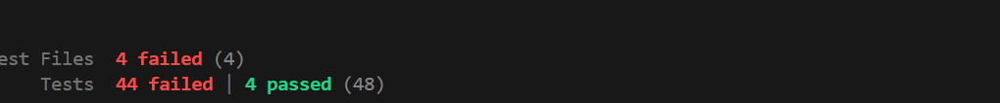
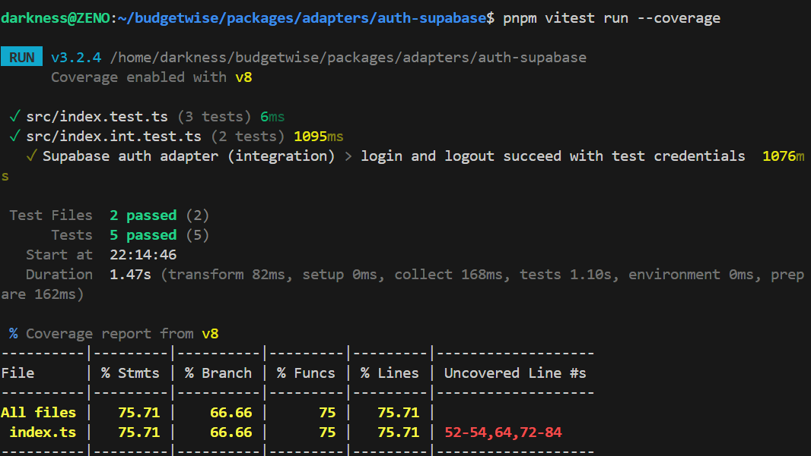
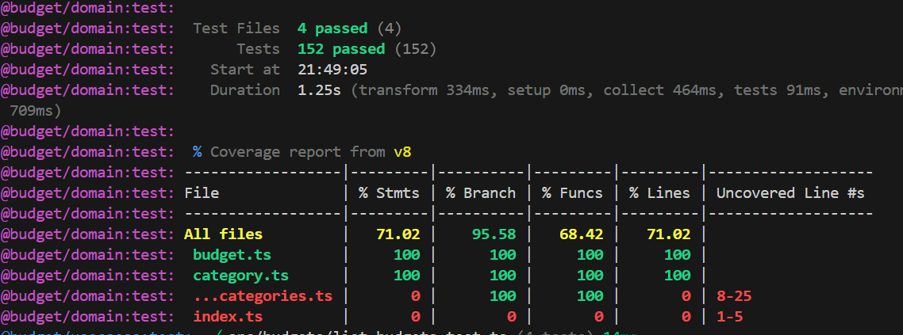
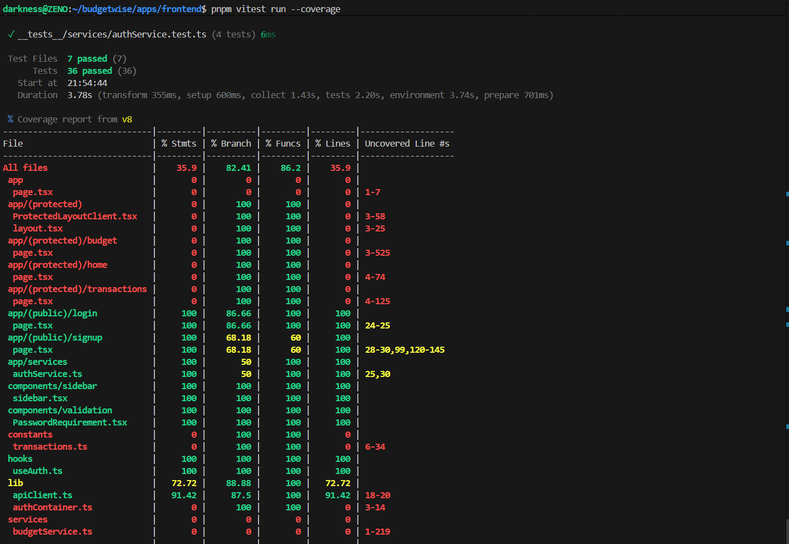
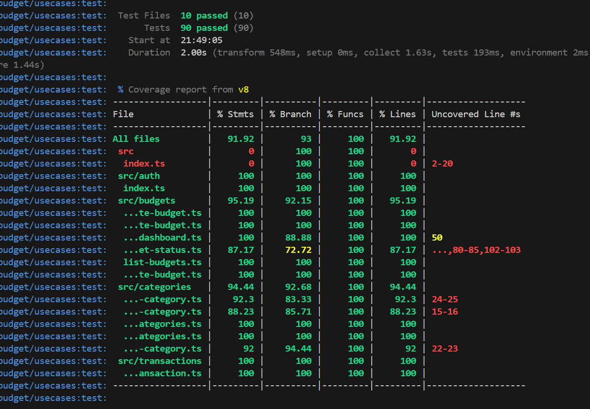
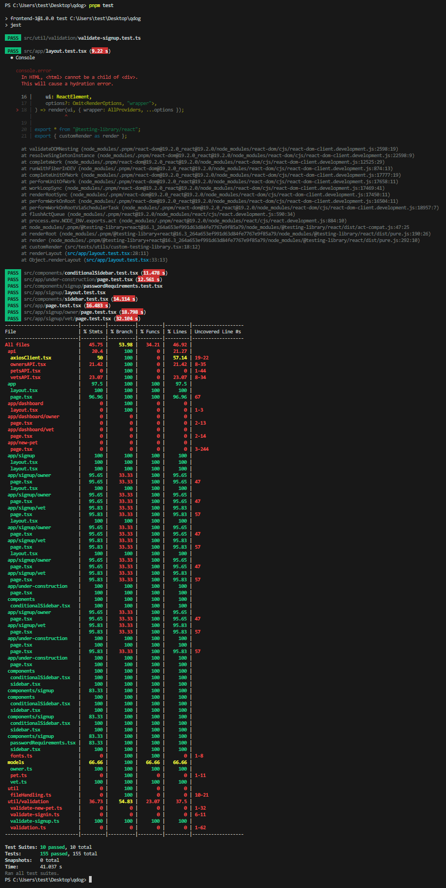

# Sprint 1 Worksheet

> This deliverable focuses on testing coverage, test importance, and environment reproducibility.

## 1. Testing Plan

Link: [TESTING_PLAN.md](TESTING_PLAN.md)

> [!WARNING]
> {MISSING_TODO}
> - The testing file is linked, but IT IS NOT COMPLETE!

## 2. Unit / Integration / Acceptance Testing

### Backend

> We test the core business and application layers with unit and acceptance-style tests. Domain tests enforce invariants and value objects without any dependencies. Usecase tests drive real flows such as creating categories and budgets, adding transactions, computing period status, and rolling up category dashboards—using in-memory repositories and deterministic system ports (fixed clock and ID) so results are repeatable. We assert exact edge semantics like duplicate name rules per user, active/inactive filtering, budget amount bounds, 0%/>= alert thresholds, and the idempotency of seeding defaults. We also run a single end-to-end acceptance path that links Category → Budget → Transaction → Dashboard to ensure the same rules hold when pieces work together.

> At the HTTP layer, we run API integration tests directly against the Hono app. We exercise all key endpoints end-to-end—create/list/update/delete for categories and budgets, adding transactions, filtering active-only lists, preventing category deletion when budgets exist, and verifying that duplicate category names are allowed across different users but not within the same user. We parse responses with typed helpers to keep DTOs strict, and assert status codes, payload shapes, and validation errors rather than over-mocking internals. This gives us contract-level confidence while staying fast and deterministic.

> Authentication and adapters are tested thoughtfully. Route tests set SUPABASE_JWT_SECRET in the worker env and mock jose to map bearer tokens to user IDs, avoiding real network calls while still exercising the auth middleware (missing/invalid header, invalid token, wrong user access). The Supabase auth adapter runs only when the right environment variables are present, so it can hit a real project in controlled environments. We keep usecase and API tests deterministic with a fixed clock and ID generator, ensuring period math and aggregation calculations don’t flake.

> We skip unit tests where there isn’t meaningful backend logic. We leave out thin composition/DI wiring that just connects parts, barrel re-exports, trivial mappers/serializers, and glue code that simply forwards calls. These change frequently and add noise without catching real defects. The higher-level API and usecase tests already cover observable behavior and contracts users and clients rely on.

### Frontend

> We test the logic layer with unit tests and simple use case tests. We run pure domain rules without outside services and check totals, ownership, and validation. We drive the use cases with lightweight fakes for data and a fixed clock and id so results are repeatable. We assert outcomes like correct sums, over budget flags, alert thresholds, and keeping each user’s data separate. Our coverage focuses on key flows. Creating categories and budgets, adding transactions, updating the dashboard totals and remaining, and aggregating multiple budgets in one category. We also run one integration path that links categories, budgets, and transactions to make sure the rules still hold when pieces work together.

> We test the UI with React Testing Library and Vitest. We render real pages and components, interact like a user by typing, clicking, and submitting, and assert what is visible on screen such as text, roles and labels, error messages, and loading or disabled states. We mock Next.js useRouter and modules like authService so there is no real navigation or network, which lets us control success and failure paths. Our coverage focuses on key flows. The login page with its fields, show or hide password, and success or failure cases, and the sidebar navigation with its links, collapse behavior, and logout redirect.

> We skip unit tests where there isn’t real logic to test. We leave out thin glue files that just plug pieces together and don’t make decisions, simple presentational UI that only shows text or icons, tiny mappers or serializers that only pass data through, wiring and factory setup that just connects parts, and adapter methods that only call an SDK. These spots change often and unit tests there add noise without finding real bugs, while higher-level tests already cover the behavior users see.

> We run the Supabase auth adapter tests only when the right environment variables are present so they can hit a real project, use a fixed clock and id generator to keep use case results repeatable, drive full API flows through real HTTP handlers instead of stubbing everything, and keep UI tests lightweight by mocking Next.js routing and services rather than spinning up a real browser or network.

<!--
- Logic layer (if present): ≥80% coverage.

- UI tests: Describe approach and coverage.

- If unit tests are missing for some classes/methods, explain why and how quality is being ensured.

- Describe any unusual/unique aspects of your testing approach.

-->

### Coverage Report

## 3. Testing Importance

Top 3 tests for each category:

### Unit Tests

> 1. https://github.com/COMP-4350-Group-6/budgetwise/blob/main/packages/domain/src/budget.test.ts
- checks Budget domain behavior in isolation (no I/O/framework)
- verifies constructor validation: non-negative integer amountCents, non-empty name, valid date window
- verifies alert logic at boundaries: thresholds 0%, 80%, zero budgets
- verifies time-window activation via isActive
- ensures domain invariants/business rules for thresholds, totals, and alerts before API/use cases

> 2. https://github.com/COMP-4350-Group-6/budgetwise/blob/main/packages/domain/src/category.test.ts
- checks Category domain validation in isolation
- verifies name rules: non-empty, not whitespace-only, max length, reject digits/special chars/emoji (as specified)
- verifies optional fields: description, icon, color
- verifies immutability expectations
- verifies timestamp preservation
- ensures consistent categorization logic for downstream budgets/transactions/dashboards

> 3. https://github.com/COMP-4350-Group-6/budgetwise/blob/main/packages/domain/src/user.test.ts
- checks User domain validation in isolation
- verifies robust email validation across numerous edge cases
- verifies name validation, including international/Unicode scenarios
- verifies currency handling
- verifies immutability and timestamp integrity
- ensures user data integrity independent of the auth adapter for signup/login/profile flows

### Integration Tests

> 1. https://github.com/COMP-4350-Group-6/budgetwise/blob/main/packages/usecases/src/integration/category-budget-transaction.integration.test.ts  
- checks the orchestration across categories, budgets, and transactions. then links records, aggregates spending into category and budget totals, and checks domain rules with integrated repositories 
- verifies you can create a category and one or more monthly budgets tied to it
- verifies adding transactions to that budget increases spent for the correct category/budget
- verifies the dashboard totals are correct (totalBudgetCents = sum of budgets, totalSpentCents = sum of relevant transactions, totalRemainingCents = budget − spent)
- verifies over-budget/alert thresholds flip when spend passes the limit
- verifies only the requesting user’s data is included and multiple budgets in one category are aggregated together

> 2. https://github.com/COMP-4350-Group-6/budgetwise/blob/main/apps/api/src/routes/transactions.int.test.ts 
- checks the transactions HTTP endpoint end to end through request validation, use case execution, and persistence, asserting status codes, response structure, and correct updates to stored data and aggregates 
- verifies POST /transactions with a valid body returns 201 and JSON including a generated id
- verifies the transaction is actually persisted and linked to the given budget/category
- verifies bad input is rejected with the right status code
- verifies downstream aggregates update, fetching data after the POST shows the new spent totals

> 3. https://github.com/COMP-4350-Group-6/budgetwise/blob/main/packages/adapters/auth-supabase/src/index.int.test.ts 
- validates the Supabase auth adapter against domain auth ports, covering session and token handling, error mapping, and overall adapter-domain contract compliance
- verifies getMe returns null when not signed in
- verifies login with valid test credentials creates a session and logout clears it

### Acceptance Tests

> 1. Category Acceptance Test Coverage

Test Location: Primary test suite: [`apps/api/src/routes/categories.test.ts`](https://github.com/COMP-4350-Group-6/budgetwise/apps/api/src/routes/categories.test.ts)

**What's Covered**

Core CRUD Operations
- **Creation**: Minimal and full payloads validated
- **Listing & Filtering**: Active-only filtering works correctly
- **Updates**: Partial updates supported (only modified fields change)
- **Deletion**: Protected deletion (blocked when budgets exist)

Security & Validation
- Authentication enforcement (401 when missing)
- Cross-user protection (users can't modify others' categories)
- Input validation:
  - Required fields enforced
  - Invalid inputs rejected (numbers, punctuation, emojis in names)
  - Unicode icons allowed
  - Maximum name length validated

Data Integrity
- Default category seeding (idempotent, no duplicates)
- Duplicate names allowed across different users (tenant isolation)
- Concurrency handling (parallel category creation)
- Active status toggling

## 4. Reproducible Environments

[REVIEWING GROUP 2]

The clarity of documentation was great at the start but there were a few things that threw me for a bit of a loop.

1. (Possibly out of scope for this review) First was that I came in with the assumption that I only needed 1 repo. UM Learn lists only on link for group 2, which would not be an issue if I didn't initially see that group 4 had two links one for the front and one for the back. I didn't realize there were 2 repos I needed for group 2 until halfway through, which caused some head scratching. (The CONTRIBUTING.md file does make it clear that there are multiple repos)

2. When I got to the step `### 4: Setup and Run Back End Server` I spent quite some time installing the tools in the first few steps. However when I was waiting for everything to install, I began reading the upcoming steps and felt like even if I finished installing everything I would be unable to complete step `8. Set up Firestore authentication:` due to not having the auth file. I decided to try to build and run the web app without the backend and it appeared to build and run successfully. I then ran their tests with the provided `pnpm test` command, and all tests passed (The  image is said command's execution)

If I remove the time I spend working on the backend (which I never finished), then the time from downloading the repo to when the tests finished running would be under 10 minutes.

Other things to note:

- I never ran the GitHub workflow tests that would have been run automatically I believe when Pushing & Pulling to & from the repo with Husky. Checking the Actions tab in the repo does show that these workflows are running when commits are made.
- I found it difficult to know if I was running the tests correctly. Either a document or heading in the readme; dedicated to summarizing the tests for the project would have been useful to me (I could not find a wiki on the repo or link to the testing plan that would serve the same purpose)

Despite my critiques, if I were a new developer joining their team, I would be content with their documentation. Many of my concerns would have been resolved instantly over a hypothetical team chat, and their app appears to be well structured and stable.

