# BudgetWise Architecture Documentation

## Table of Contents
- [Overview](#overview)
- [Architecture Pattern](#architecture-pattern)
- [Project Structure](#project-structure)
- [Layer Deep Dive](#layer-deep-dive)
- [Data Flow](#data-flow)
- [Technology Stack](#technology-stack)
- [Mermaid Diagrams](#mermaid-diagrams)
- [Presentation Points](#presentation-points)

---

## Overview

BudgetWise is a **personal finance management application** built using **Clean Architecture** (also known as Hexagonal Architecture / Ports and Adapters). The system is deployed on **Cloudflare Workers** with **Supabase** as the backend database and authentication provider.

### Key Features
- Budget management with categories and periods
- Transaction tracking and categorization
- AI-powered invoice parsing and auto-categorization (via OpenRouter/LLMs)
- Multi-currency support
- Real-time budget alerts and dashboards

---

## Architecture Pattern

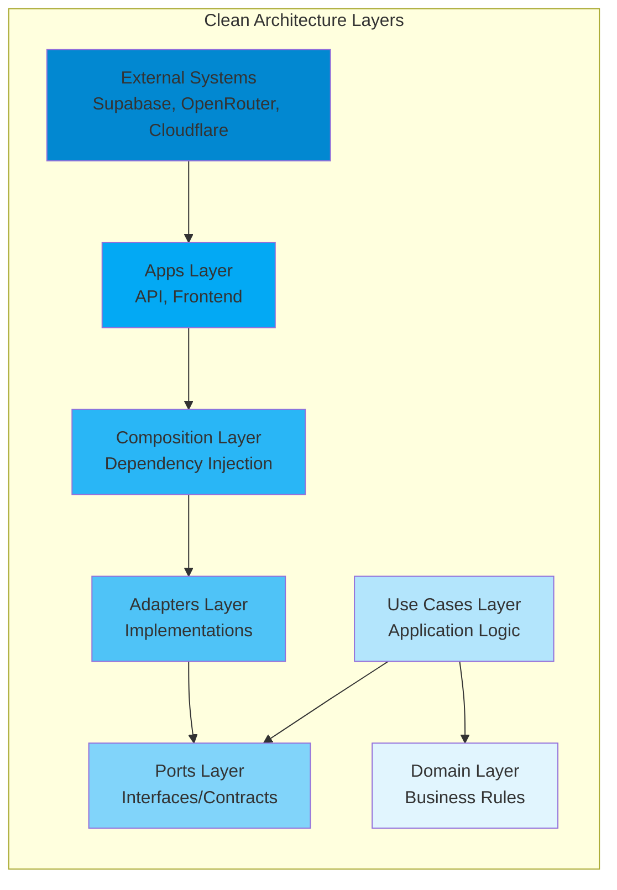

### The Dependency Rule
**Dependencies point INWARD**. The inner layers have no knowledge of outer layers.

| Layer | Depends On | Description |
|-------|-----------|-------------|
| Domain | Nothing | Pure business entities and rules |
| Use Cases | Domain, Ports | Application-specific business rules |
| Ports | Domain | Abstract interfaces (contracts) |
| Adapters | Domain, Ports | Concrete implementations |
| Composition | All packages | Wires everything together |
| Apps | Composition | Delivery mechanisms (HTTP, UI) |

---

## Project Structure

```
budgetwise/
├── packages/                    # Core packages (Clean Architecture layers)
│   ├── domain/                  # 🎯 INNERMOST: Business entities
│   ├── ports/                   # 📋 Interfaces/Contracts
│   ├── usecases/               # ⚡ Application business logic
│   ├── adapters/               # 🔌 Implementations
│   │   ├── auth-supabase/      #    Authentication adapter
│   │   ├── persistence/        #    Database adapters
│   │   │   ├── local/          #    In-memory (testing)
│   │   │   └── supabase/       #    Supabase Postgres
│   │   ├── services/           #    External services
│   │   │   └── openrouter/     #    AI/LLM integration
│   │   └── system/             #    Clock, ID generators
│   ├── composition/            # 🔧 Dependency injection containers
│   │   ├── cloudflare-worker/  #    Server-side DI
│   │   └── web-auth-client/    #    Client-side auth DI
│   ├── schemas/                # ✅ Zod validation schemas
│   └── config/                 # ⚙️ Shared TypeScript config
├── apps/                       # Deployable applications
│   ├── api/                    # 🌐 Hono REST API (Cloudflare Workers)
│   └── frontend/               # 💻 Next.js React application
├── infra/                      # Infrastructure
│   └── supabase/               # Database migrations & config
└── e2e-tests/                  # Playwright end-to-end tests
```

---

## Layer Deep Dive

### 1. Domain Layer (`packages/domain`)
The **heart** of the application. Contains pure business entities with no external dependencies.

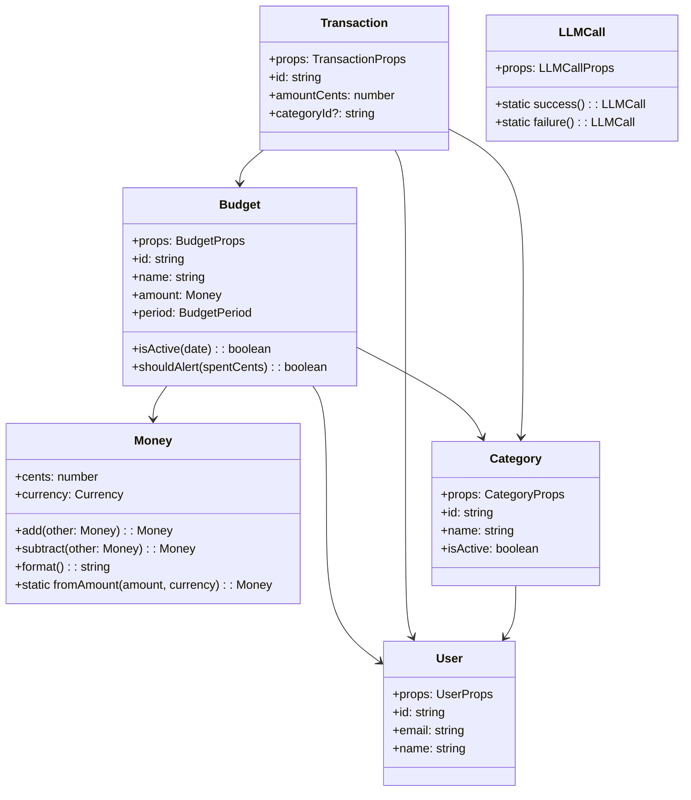

#### Key Domain Entities:
- **`Money`** - Value object for monetary amounts (avoids floating-point issues)
- **`Budget`** - Budget allocation with period, amount, and alert thresholds
- **`Transaction`** - Individual income/expense record
- **`Category`** - Expense/income classification
- **`User`** - User profile with preferences
- **`LLMCall`** - Tracks AI service usage for cost monitoring

### 2. Ports Layer (`packages/ports`)
**Interfaces** that define contracts for external dependencies.

```mermaid
graph LR
    subgraph Ports["📋 Ports (Interfaces)"]
        subgraph Repositories
            BR[BudgetsRepo]
            TR[TransactionsRepo]
            CR[CategoriesRepo]
            UR[UsersRepo]
            LR[LLMCallsRepo]
        end
        
        subgraph Auth
            AS[AuthServerPort]
            AC[AuthClientPort]
        end
        
        subgraph Services
            CP[CategorizationPort]
            IP[InvoiceParserPort]
            LT[LLMTrackerPort]
        end
        
        subgraph System
            CL[ClockPort]
            ID[IdPort]
        end
    end
```

#### Key Ports:
```typescript
// Repository Port Example
interface BudgetsRepo {
  getById(id: string): Promise<Budget | null>;
  listByUser(userId: string): Promise<Budget[]>;
  create(budget: Budget): Promise<void>;
  update(budget: Budget): Promise<void>;
  delete(id: string): Promise<void>;
}

// Service Port Example
interface CategorizationPort {
  categorizeTransaction(
    note: string,
    amountCents: number,
    categories: CategoryInfo[],
    userId?: string
  ): Promise<CategorizationResult | null>;
}

// System Port Example
interface ClockPort { now(): Date }
interface IdPort { ulid(): string }
```

### 3. Use Cases Layer (`packages/usecases`)
**Application-specific business rules**. Orchestrates domain entities and ports.

```mermaid
flowchart LR
    subgraph UseCases["⚡ Use Cases"]
        subgraph Budgets
            CB[createBudget]
            LB[listBudgets]
            UB[updateBudget]
            DB[deleteBudget]
            GBS[getBudgetStatus]
            GBD[getBudgetDashboard]
        end
        
        subgraph Transactions
            AT[addTransaction]
            UT[updateTransaction]
            DT[deleteTransaction]
            CT[categorizeTransaction]
            PI[parseInvoice]
        end
        
        subgraph Categories
            CC[createCategory]
            LC[listCategories]
            UC[updateCategory]
            SDC[seedDefaultCategories]
        end
        
        subgraph Auth
            AU[authUsecases]
        end
    end
```

#### Factory Pattern for Use Cases:
```typescript
// Use cases are created via factory functions
function makeCreateBudget(deps: {
  budgetsRepo: BudgetsRepo;
  clock: ClockPort;
  id: IdPort;
}) {
  return async (input: CreateBudgetInput): Promise<Budget> => {
    const budget = new Budget({
      id: deps.id.ulid(),
      ...input,
      createdAt: deps.clock.now(),
      updatedAt: deps.clock.now(),
    });
    await deps.budgetsRepo.create(budget);
    return budget;
  };
}
```

### 4. Adapters Layer (`packages/adapters`)
**Concrete implementations** of ports.

```mermaid
graph TB
    subgraph Adapters["🔌 Adapters"]
        subgraph Persistence
            SP[Supabase Repos]
            LP[Local/In-Memory Repos]
        end
        
        subgraph AuthAdapter[Auth]
            SA[Supabase Auth Client]
        end
        
        subgraph Services
            OR[OpenRouter AI]
        end
        
        subgraph SystemAdapters[System]
            SC[System Clock]
            UI[ULID Generator]
        end
    end
    
    subgraph External["☁️ External Services"]
        SB[(Supabase)]
        ORA[OpenRouter API]
        CF[Cloudflare Workers]
    end
    
    SP --> SB
    SA --> SB
    OR --> ORA
    
    style SB fill:#3ecf8e
    style ORA fill:#9333ea
    style CF fill:#f38020
```

#### Adapter Examples:
```typescript
// Supabase Budget Repository
function makeSupabaseBudgetsRepo({ client }): BudgetsRepo {
  return {
    async getById(id) {
      const { data } = await client.from("budgets").select().eq("id", id);
      return data ? toBudget(data) : null;
    },
    // ... other methods
  };
}

// OpenRouter Categorization Service
class OpenRouterCategorization implements CategorizationPort {
  async categorizeTransaction(note, amountCents, categories) {
    const response = await fetch('https://openrouter.ai/api/v1/chat/completions', {
      // ... LLM prompt for categorization
    });
    return parseCategorizationResult(response);
  }
}
```

### 5. Composition Layer (`packages/composition`)
**Dependency Injection Container** - Wires all layers together.

```mermaid
flowchart TB
    subgraph Container["🔧 Composition Container"]
        ENV{Environment Config}
        
        ENV -->|Supabase URL + Key| SR[Supabase Repos]
        ENV -->|In-Memory| LR[Local Repos]
        ENV -->|OpenRouter Key| AI[AI Services]
        
        SR --> UC[Use Cases Factory]
        LR --> UC
        AI --> UC
        
        UC --> EXPORT[Exported Container]
    end
    
    subgraph Exports["Container Exports"]
        REPOS[repos: budgetsRepo, txRepo, ...]
        SVCS[services: llmTracker]
        USEC[usecases: createBudget, addTransaction, ...]
    end
    
    EXPORT --> REPOS
    EXPORT --> SVCS
    EXPORT --> USEC
```

```typescript
// Container factory function
function makeContainer(env?: Env) {
  const clock = makeSystemClock();
  const id = makeUlid();
  
  // Choose adapter based on environment
  const budgetsRepo = env?.SUPABASE_URL 
    ? makeSupabaseBudgetsRepo({ client: supabaseClient })
    : makeInMemBudgetsRepo();
  
  return {
    repos: { budgetsRepo, txRepo, categoriesRepo },
    usecases: {
      createBudget: makeCreateBudget({ budgetsRepo, clock, id }),
      // ... other use cases
    }
  };
}
```

### 6. Apps Layer (`apps/`)
**Delivery mechanisms** - HTTP API and Web UI.

#### API (`apps/api`)
- **Framework**: Hono (lightweight, edge-native)
- **Runtime**: Cloudflare Workers
- **Auth**: JWT verification via Supabase JWKS

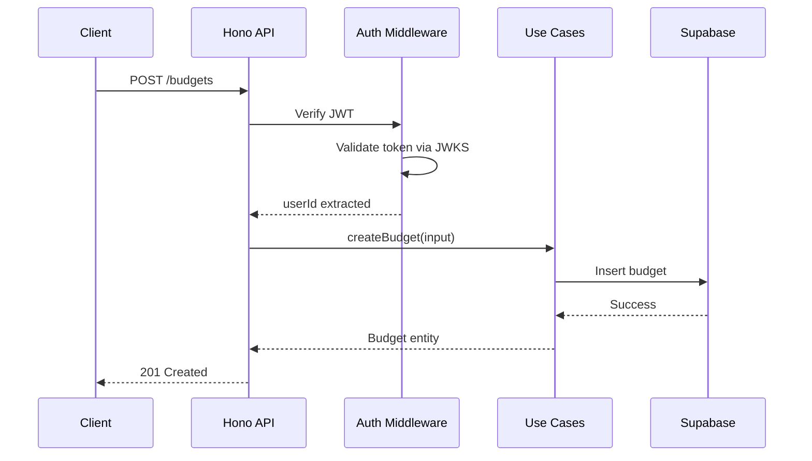

#### Frontend (`apps/frontend`)
- **Framework**: Next.js 14 (App Router)
- **Styling**: Tailwind CSS
- **Auth**: Supabase Auth Client
- **State**: React hooks + Server Components

---

## Data Flow

### Complete Request Flow

```mermaid
flowchart TB
    subgraph Client["🌐 Client"]
        UI[Next.js Frontend]
    end
    
    subgraph Edge["⚡ Cloudflare Edge"]
        API[Hono API]
        AUTH[Auth Middleware]
    end
    
    subgraph Business["📦 Business Logic"]
        UC[Use Cases]
        DOM[Domain Entities]
    end
    
    subgraph Data["💾 Data Layer"]
        REPO[Repository Ports]
        SB[(Supabase Postgres)]
    end
    
    subgraph AI["🤖 AI Services"]
        OR[OpenRouter]
        CAT[Categorization]
        INV[Invoice Parser]
    end
    
    UI -->|HTTP + JWT| API
    API -->|Verify| AUTH
    AUTH -->|userId| UC
    UC -->|create/validate| DOM
    UC -->|persist| REPO
    REPO -->|SQL| SB
    UC -->|auto-categorize| CAT
    UC -->|parse receipt| INV
    CAT --> OR
    INV --> OR
```

### Authentication Flow

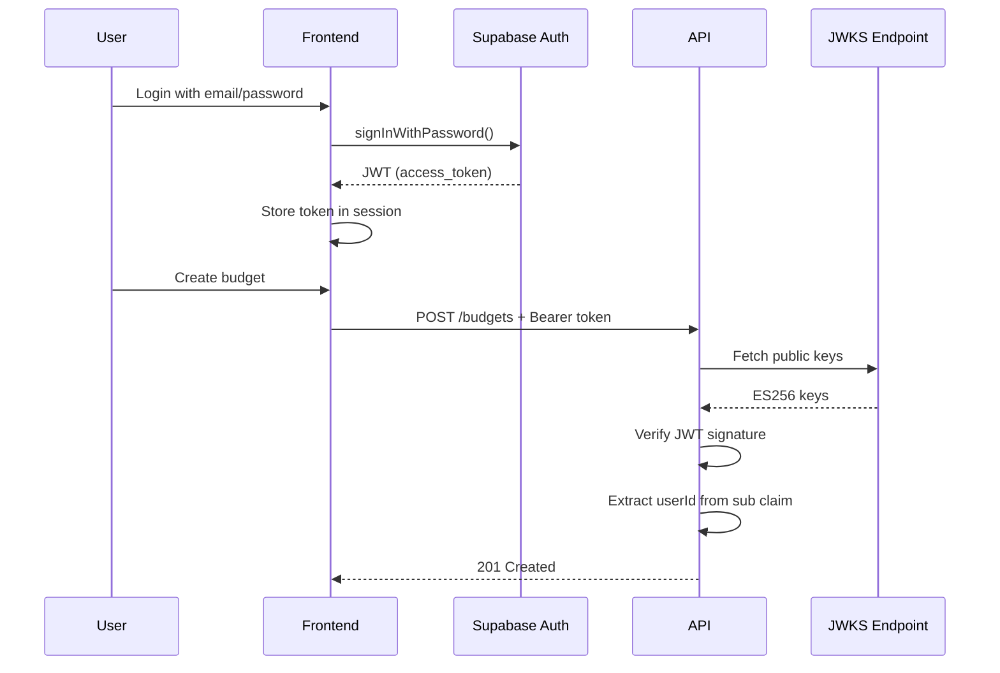

---

## Technology Stack

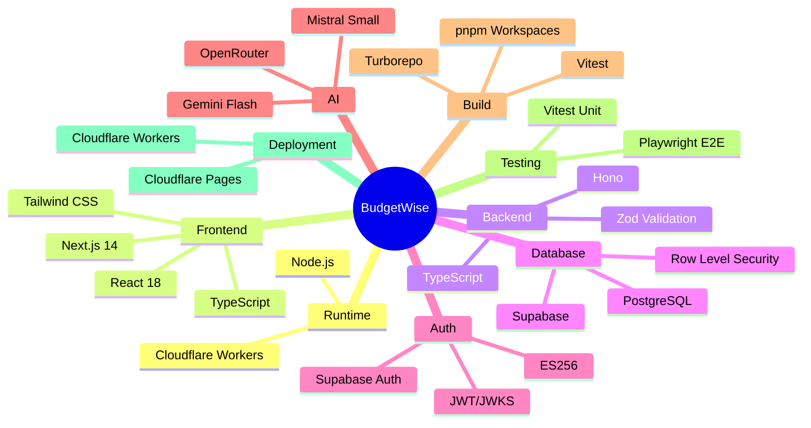

---

## Database Schema

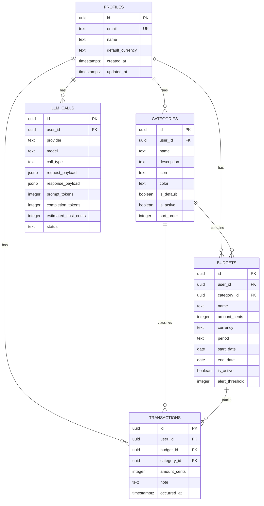

---

## Presentation Points

### 1. **Why Clean Architecture?**

> "The architecture of a software system is defined by the boundaries that separate it into parts." - Robert C. Martin

**Key Benefits:**
- ✅ **Testability**: Domain and use cases can be tested without databases
- ✅ **Independence**: Framework changes don't affect business logic
- ✅ **Flexibility**: Swap Supabase for another DB without touching use cases
- ✅ **Maintainability**: Clear separation of concerns

**Talk Point:** *"Our domain layer has ZERO dependencies. We can run budget calculations in a unit test without spinning up a database."*

---

### 2. **The Dependency Rule**

```
External → Apps → Adapters → Ports → Use Cases → Domain
           ←────────── Dependencies Point Inward ──────────
```

**Talk Point:** *"Notice how `Budget.ts` in domain doesn't import anything from Supabase, Hono, or React. It's pure TypeScript with pure business rules."*

---

### 3. **Ports and Adapters Pattern**

**Port (Interface):**
```typescript
interface BudgetsRepo {
  create(budget: Budget): Promise<void>;
}
```

**Adapters (Implementations):**
- `makeSupabaseBudgetsRepo()` → Production
- `makeInMemBudgetsRepo()` → Testing

**Talk Point:** *"We have two implementations of the same interface. In tests, we use in-memory stores. In production, we hit Supabase. The use cases don't know the difference."*

---

### 4. **Dependency Injection via Composition**

```typescript
// The container decides what adapters to use
const container = makeContainer({
  SUPABASE_URL: env.SUPABASE_URL,      // Use real DB
  OPENROUTER_API_KEY: env.OPENROUTER,   // Enable AI features
});
```

**Talk Point:** *"The composition root is the ONLY place that knows about concrete implementations. Everything else works with interfaces."*

---

### 5. **Monorepo Benefits**

```
packages/
├── domain/      → npm: @budget/domain
├── ports/       → npm: @budget/ports  
├── usecases/    → npm: @budget/usecases
├── adapters/    → npm: @budget/adapters-*
└── composition/ → npm: @budget/composition-*
```

**Talk Point:** *"Each layer is its own npm package. Package boundaries prevent accidental imports - domain can't import from adapters because it's not in its `package.json` dependencies."*

> ⚠️ **Note:** Turborepo handles task orchestration (build order, caching) but does NOT enforce import boundaries. The enforcement comes from:
>
> 1. **package.json dependencies** - A package can only import what's listed in its deps
> 2. **Code review discipline** - Catch violations in PRs
>
> For stricter enforcement, consider adding:
>
> - `eslint-plugin-boundaries` - Lint rules for layer violations
> - `@nx/enforce-module-boundaries` - If migrating to Nx
> - Custom CI script to detect forbidden imports

---

### 6. **Edge-First Architecture**

- **Cloudflare Workers**: Runs in 300+ locations worldwide
- **Hono**: Lightweight (12KB), designed for edge
- **Supabase**: Postgres + Auth + Real-time

**Talk Point:** *"Our API runs at the edge. A user in Tokyo gets served from a Japanese data center, not a US server."*

---

### 7. **AI Integration Pattern**

```typescript
// The use case doesn't know OpenRouter exists
const categorizeTransaction = makeCategorizeTransaction({
  categorization: categorizationPort,  // Interface
  txRepo: transactionsRepo,
  clock: clock,
});
```

**Talk Point:** *"We can swap OpenRouter for OpenAI, Claude, or even a rule-based system. The use case just calls `categorization.categorizeTransaction()`."*

---

### 8. **Testing Strategy**

| Layer | Test Type | Dependencies |
|-------|-----------|--------------|
| Domain | Unit | None |
| Use Cases | Unit | Mock ports |
| Adapters | Integration | Real services |
| Apps | E2E | Full stack |

**Talk Point:** *"Our test pyramid: Lots of fast domain/use case tests, fewer adapter tests, minimal E2E tests."*

---

### 9. **Money as Value Object**

```typescript
// Never use floats for money!
const budget = Money.fromAmount(100.50, 'USD');  // Stored as 10050 cents
budget.add(Money.fromAmount(0.01, 'USD'));       // Safe addition
```

**Talk Point:** *"We store all money as integers (cents). This avoids the classic 0.1 + 0.2 !== 0.3 problem."*

---

### 10. **Security by Design**

- **JWT Verification**: JWKS-based ES256 verification
- **Row Level Security**: Supabase RLS policies
- **User Scoping**: Every query includes `userId`

```typescript
// Every repo method is scoped to user
async listByUser(userId: string) {
  return client.from("budgets").select().eq("user_id", userId);
}
```

**Talk Point:** *"Even if someone hacks past our middleware, Supabase RLS ensures they can only see their own data."*

---

## Quick Reference: Package Dependencies

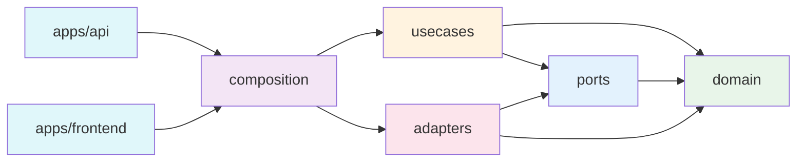

---

## Conclusion

BudgetWise demonstrates how Clean Architecture principles can be applied to a modern TypeScript monorepo:

1. **Domain-Driven**: Business logic is isolated and testable
2. **Port/Adapter**: External systems are pluggable
3. **Composition Root**: Single place for dependency wiring
4. **Edge-Native**: Optimized for Cloudflare Workers
5. **AI-Ready**: LLM integration without coupling

This architecture scales from a solo project to a team of developers, and from local testing to global edge deployment.

