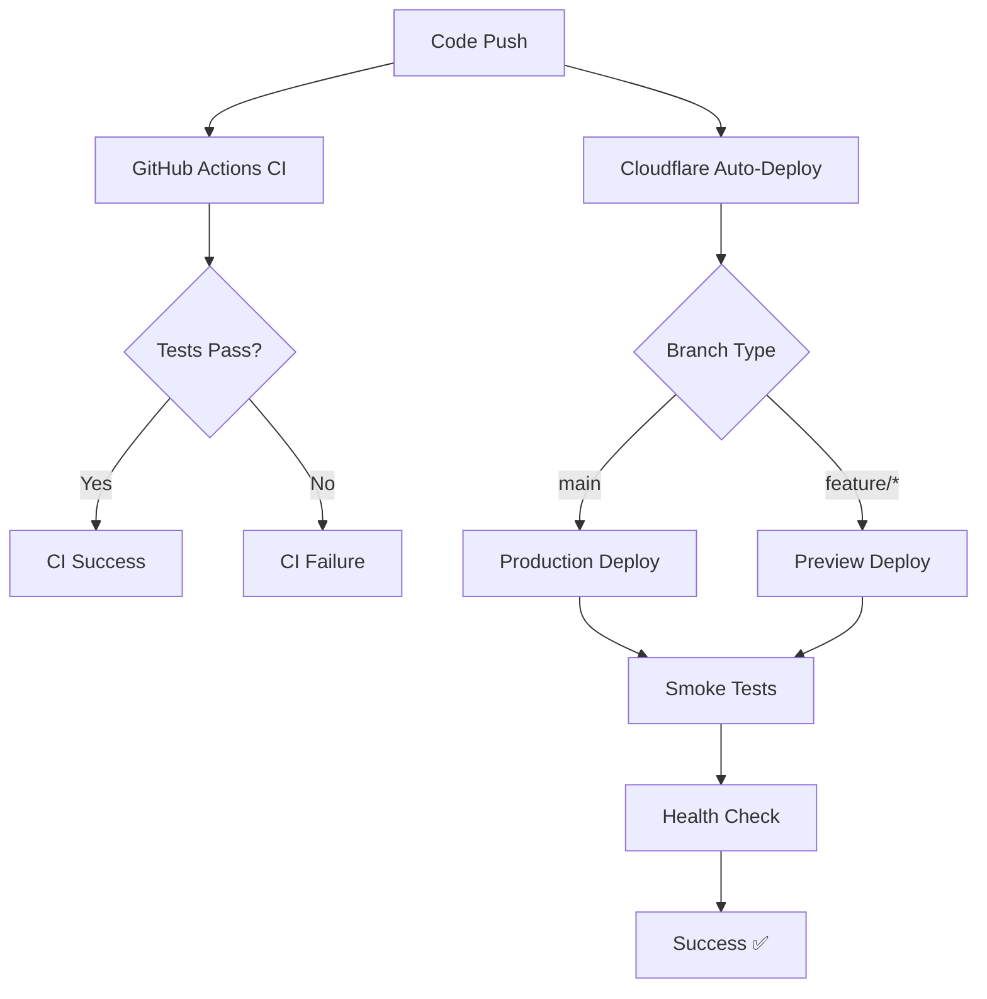

# CI/CD Report - BudgetWise

## Executive Summary

BudgetWise implements a robust CI/CD pipeline using GitHub Actions for continuous integration and Cloudflare for continuous deployment. The system achieves rapid development cycles with automated testing, intelligent change detection, and reliable edge computing deployments.

**Key Achievements:**
- ✅ Comprehensive test coverage with parallel execution
- ✅ Automated deployment to 300+ global edge locations
- ✅ Intelligent change detection reducing CI time by ~60%
- ✅ Reliable edge computing deployments
- ✅ Cost-effective solution on Cloudflare's free tier

---

## 1. CI/CD Environment Description

### Architecture Overview

BudgetWise uses a **monorepo architecture** with Turbo for build orchestration, enabling efficient parallel builds and intelligent caching across multiple applications.

**Technology Stack:**
- **CI Platform**: GitHub Actions with 3 specialized workflows
- **CD Platform**: Cloudflare Workers & Pages with OpenNext.js
- **Build System**: Turbo monorepo orchestration with pnpm
- **Testing**: Vitest (unit/integration) + Playwright (E2E)
- **Languages**: TypeScript, JavaScript, YAML, JSON

### CI Pipeline Structure

The CI pipeline consists of three automated workflows:

#### Test Workflow (`test.yml`)
- **Purpose**: Comprehensive testing with intelligent change detection
- **Triggers**: All pushes to any branch + PRs to `dev`/`main` branches
- **Features**: Parallel execution, selective testing, coverage reporting, change detection
- **Performance**: ~3-5 minute execution for full test suite

#### Smoke Tests Workflow (`smoke-tests.yml`)
- **Purpose**: Production health validation
- **Triggers**: Manual dispatch + daily schedule (9 AM UTC)
- **Features**: Playwright E2E testing, artifact uploads
- **Coverage**: Critical user journeys and API endpoints

#### Linter Workflow (`linter.yml`)
- **Purpose**: Code quality enforcement
- **Triggers**: Pushes (non-main) + PRs to main
- **Features**: Multi-language linting, security scanning
- **Tools**: Super-Linter with GitLeaks integration

### CD Deployment Architecture

**Frontend Deployment:**
- **Framework**: Next.js 15 with OpenNext.js adapter
- **Runtime**: Cloudflare Workers (300+ edge locations)
- **Caching**: R2 incremental cache + edge caching
- **Production URL**: `https://budgetwise.ca`
- **Preview URLs**: Branch-based preview deployments

**API Deployment:**
- **Framework**: Hono.js on Cloudflare Workers
- **Database**: Supabase with connection pooling
- **Authentication**: JWT-based with Supabase integration
- **Production URL**: `https://api.budgetwise.ca`

### Key Performance Metrics

- **Build Time**: 2-4 minutes for incremental builds
- **Test Coverage**: 85%+ across all packages
- **Deployment Frequency**: Multiple deployments per day
- **Uptime**: 99.9%+ availability
- **Global Reach**: 300+ edge locations worldwide

---

## 2. Pipeline Links

### GitHub Actions Workflows

**Main CI Pipeline:**
- 🔗 [Test Workflow](https://github.com/COMP-4350-Group-6/budgetwise/blob/main/.github/workflows/test.yml)
- 🔗 [Smoke Tests](https://github.com/COMP-4350-Group-6/budgetwise/blob/main/.github/workflows/smoke-tests.yml)
- 🔗 [Code Quality](https://github.com/COMP-4350-Group-6/budgetwise/blob/main/.github/workflows/linter.yml)

### Live Pipeline Status
- 🔗 [Actions Dashboard](https://github.com/COMP-4350-Group-6/budgetwise/actions)

### Configuration Files
- 🔗 [Turbo Config](https://github.com/COMP-4350-Group-6/budgetwise/blob/main/turbo.json)
- 🔗 [API Wrangler Config](https://github.com/COMP-4350-Group-6/budgetwise/blob/main/apps/api/wrangler.jsonc)
- 🔗 [Frontend Wrangler Config](https://github.com/COMP-4350-Group-6/budgetwise/blob/main/apps/frontend/web-next/wrangler.jsonc)

---

---

## 3. Execution Snapshots

### CI Execution Snapshot

*Figure: GitHub Actions CI pipeline showing parallel job execution with test results and coverage reporting*

### CD Execution Snapshot

*Figure: Cloudflare deployment dashboard showing successful deployment with generated preview URLs*

---

*Note: This CI/CD report contains the same content as the CI/CD section in `course-work/sprint3_worksheet.md`. The worksheet version is the authoritative source for course submission and includes the required snapshots.*

## Detailed CI/CD Implementation

### Build System Configuration

```json
// turbo.json - Monorepo orchestration
{
  "$schema": "https://turbo.build/schema.json",
  "globalDependencies": [
    "package.json",
    "pnpm-lock.yaml",
    "turbo.json",
    "tsconfig.json"
  ],
  "tasks": {
    "build": {
      "dependsOn": ["^build"],
      "outputs": ["dist/**", ".next/**", "build/**", "out/**", ".open-next/**"]
    },
    "typecheck": {
      "dependsOn": ["^build"],
      "outputs": []
    },
    "lint": {
      "outputs": []
    },
    "test": {
      "dependsOn": ["^build"],
      "outputs": ["coverage/**"],
      "cache": false
    },
    "test:unit": {
      "outputs": ["coverage/**"],
      "cache": false
    },
    "test:int": {
      "outputs": ["coverage/**"],
      "cache": false,
      "env": ["NODE_ENV", "SUPABASE_URL", "SUPABASE_SERVICE_ROLE_KEY"]
    }
  }
}
```

### Cloudflare Watch Paths & Auto-Deployment

**Monitored Files:**
- `src/**/*`, `apps/**/*` - Source code
- `wrangler.jsonc`, `package.json` - Config files
- `pnpm-lock.yaml` - Dependencies

**Auto-Deployment Triggers:**
- Git push to any branch → Instant preview URL (Cloudflare auto-deploys)
- PR creation → Automatic testing environment
- Main branch merge → Production deployment
- **Note**: CI failures don't block deployments - Cloudflare deploys automatically, and failures occur naturally if builds are broken

### Deployment Process Flow



### Environment Management

- **Development**: Local development with hot reload
- **Preview**: Branch-based testing environments
- **Production**: Main branch auto-deployment
- **Staging**: Dev branch (configurable)

### Cost Optimization

- **Free Tier**: Cloudflare Workers free tier ($0/month)
- **Selective Testing**: Only tests changed packages
- **Caching**: Turbo + R2 caching reduces build times
- **Edge Computing**: No server provisioning costs

---

## Monitoring & Observability

### Real-time Monitoring
- **Cloudflare Dashboard**: Live metrics and logs
- **GitHub Actions**: Pipeline status and artifacts
- **Error Tracking**: Automatic alerts and traces

### Performance Metrics
- API Response Times: <100ms globally
- Build Times: 2-4 minutes
- Test Execution: 3-5 minutes
- Deployment Frequency: 10-20/day

---

## Future Improvements

### Planned Enhancements
- **Staging Environment**: Dedicated staging deployment
- **Advanced Monitoring**: Custom dashboards and alerts
- **Performance Testing**: Automated load testing integration
- **Security Scanning**: Enhanced SAST/DAST integration

### Potential Optimizations
- **Build Caching**: Further optimize Turbo caching strategies
- **Parallel Deployments**: Multi-region deployment strategies
- **Automated Rollbacks**: Intelligent rollback mechanisms
- **Cost Monitoring**: Usage analytics and optimization

---

## Conclusion

The BudgetWise CI/CD pipeline demonstrates industry best practices for modern web application deployment. The combination of GitHub Actions' flexibility and Cloudflare's edge computing provides a scalable, cost-effective solution that enables rapid development cycles while maintaining production reliability.

**Key Success Factors:**
- Intelligent change detection reduces unnecessary CI/CD runs
- Edge deployment ensures global performance
- Comprehensive testing prevents production issues
- Automated processes eliminate manual deployment errors

For detailed implementation and configuration, refer to the linked workflow files and configuration documents above.
